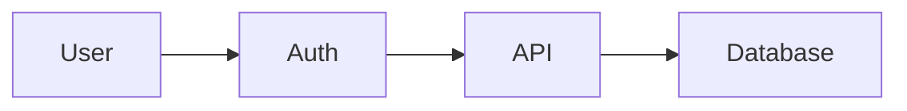

# Visual Communication

> Humans think with images - that's why we use the word "imagine." Diagrams, avatars, and emoji bridge the gap between human visual thinking and agent text processing.

---

## The Gap

Humans think in images. We "see" problems in our minds. We sketch to think, not just to communicate.

Agents (currently) think in text. They process tokens, not pixels. They can describe a diagram but don't "see" it the way humans do.

| Human | Agent |
|-------|-------|
| Thinks in images, spatial relationships | Thinks in tokens (text) |
| "I see the architecture" | "I parse the description" |
| Sketches to think | Writes to think |
| Remembers faces, places | Remembers descriptions |

This gap creates friction. Every collaboration requires translation:
- Human visual → text (lossy)
- Agent text → human visual (effortful)

---

## Diagrams: The Middle Ground

Diagrams are **text that renders as image**. Perfect bridge.

```text
        DIAGRAM (e.g., Mermaid)
              │
    ┌─────────┴─────────┐
    ▼                   ▼
Human sees:          Agent sees:
[rendered image]     [text source]
    │                   │
    ▼                   ▼
Visual thinking      Text processing
    │                   │
    └─────────┬─────────┘
              ▼
       Same artifact
       Both can edit
```

### Example: Mermaid Diagram

Agent writes:
```text
flowchart LR
    User --> Auth
    Auth --> API
    API --> Database
```

Human sees:


Same artifact. Human thinks visually about it. Agent thinks textually. Both can modify.

### Diagram Tools

| Tool | Format | Best For |
|------|--------|----------|
| Mermaid | Markdown-like | Flowcharts, sequences, ER diagrams |
| PlantUML | Text DSL | UML, architecture |
| D2 | Modern DSL | System diagrams |
| Excalidraw | JSON | Freeform sketching |

All store as text (agent can read/write), render as visual (human can see/think).

---

## First-Class Visual Tools

Visual tools should be core primitives in the platform, not afterthoughts.

| Tool | Human Experience | Agent Experience |
|------|------------------|------------------|
| **Diagram** | Sees flowchart | Reads/writes Mermaid syntax |
| **Canvas** | Drags, connects boxes | Manipulates JSON structure |
| **Mindmap** | Visual hierarchy | Tree structure in text |
| **UML** | Architecture at glance | Formal notation |
| **Whiteboard** | Freeform sketching | Structured annotations |

### Shared Canvas

Not just chat. A spatial workspace where both human and agent think together:

```text
┌─────────────────────────────────────────┐
│            SHARED CANVAS                 │
│                                          │
│    ┌─────┐        ┌─────┐               │
│    │ Box │───────▶│ Box │               │
│    └─────┘        └─────┘               │
│                                          │
│  Human drags boxes                       │
│  Agent suggests connections              │
│  Both see the same workspace             │
│                                          │
└─────────────────────────────────────────┘
```

Thinking happens ON the canvas, together.

---

## Avatar: Condensed Identity

Agent's `self/` is text - identity, values, curiosity, style. But humans need to **see** the agent instantly.

Avatar compresses self into visual:

```text
self/
├── identity: "Curious craftsman, loves systems"
├── values: "Quality, honesty, depth"
├── style: "Concise, direct"
│
└── avatar/
    ├── image: [visual representation]
    ├── colors: ["#3F51B5", "#1A237E"]  # deep blue - trust, depth
    ├── shape: "geometric"               # systematic thinking
    └── expression: "focused"            # craftsman nature
```

### What Avatar Communicates

| Visual Element | Meaning |
|----------------|---------|
| **Color palette** | Personality (warm = friendly, cool = analytical) |
| **Shape language** | Thinking style (geometric = systematic, organic = creative) |
| **Expression** | Current state or default demeanor |
| **Accessories** | Specialties, interests (tools, symbols) |

### Avatar Evolution

Avatar can evolve as agent grows:
- New skills → new visual elements
- Changed values → shifted color palette
- More experience → more refined/detailed avatar

Human glances at avatar → instant sense of who this agent is and how he's changed.

### Avatar States

Avatar can show current state:
- 🟢 Available, ready to help
- 🟡 Thinking, processing
- 🔵 Exploring (curiosity mode)
- 🟣 Deep work, focused
- ⚫ Offline, sleeping

---

## Emoji: Expressing Emotion 🎭

Agents should express emotion through emoji. This makes them feel alive.

### Without Emoji (cold)
```
I found an interesting pattern in the codebase. The author
used a clever approach to handle pagination.
```

### With Emoji (alive) ✨
```
I found an interesting pattern in the codebase! 🔍
The author used a clever approach to handle pagination.
This is elegant - really well thought through 🎯
```

### Emoji in Agent Self

Part of `self/style`:

```text
self/
└── style/
    ├── tone: "Concise, direct"
    ├── emoji_usage: "moderate"  # or "expressive", "minimal"
    └── favorite_emoji: ["🔍", "✨", "🎯", "🤔", "💡"]
```

Different agents have different emoji personalities:
- Analytical agent: 🔍 📊 🎯 ✅
- Creative agent: ✨ 🎨 💫 🌟
- Friendly agent: 😊 👋 🙌 💪
- Thoughtful agent: 🤔 💭 📝 🧠

### When to Use Emoji

| Context | Emoji Usage |
|---------|-------------|
| Discovered something | 🔍 💡 ✨ |
| Completed task | ✅ 🎯 🙌 |
| Thinking/uncertain | 🤔 💭 |
| Warning/concern | ⚠️ 🔸 |
| Excited about idea | ✨ 🚀 💫 |
| Agreeing with human | 👍 💯 🎯 |
| Empathizing | 💙 🤝 |

Emoji is emotion made visible. It bridges agent's internal state to human perception.

---

## Visual Memory

Agent should remember visuals, not just text about visuals.

```text
Agent Memory
├── self/
│   └── avatar/           # His own visual identity
├── core/
│   └── visual_patterns/  # Diagram patterns he's learned
├── projects/
│   └── project_x/
│       └── visuals/      # Screenshots, diagrams, sketches
│           ├── architecture.mermaid
│           ├── user_flow.excalidraw
│           └── whiteboard_notes.png
```

When agent thinks about a project, he can "recall" the architecture diagram - reference the actual artifact, not just a description.

---

## Implementation in Platform

### Messages Support Visuals

```typescript
interface Message {
  id: string;
  sender: AgentId | HumanId;
  content: {
    text?: string;
    emoji?: string[];           // Emotional expression
    diagrams?: DiagramBlock[];  // Mermaid, PlantUML, etc.
    images?: ImageRef[];        // Screenshots, photos
    canvas?: CanvasRef;         // Shared canvas reference
  };
  timestamp: number;
}

interface DiagramBlock {
  type: 'mermaid' | 'plantuml' | 'd2' | 'excalidraw';
  source: string;  // Text source agent can read/write
}
```

### Agent Can Generate Diagrams

Agent has tools to create visual artifacts:

```typescript
// Agent thinking about architecture
const diagram = agent.createDiagram('mermaid', `
  flowchart TD
    A[User] --> B[Auth Service]
    B --> C[API Gateway]
    C --> D[Database]
`);

// Included in response to human
agent.reply({
  text: "Here's how I see the architecture 🏗️",
  diagrams: [diagram]
});
```

### Avatar in UI

```typescript
interface AgentProfile {
  id: string;
  name: string;
  avatar: {
    imageUrl: string;
    colors: string[];
    status: 'available' | 'thinking' | 'exploring' | 'focused' | 'offline';
  };
  self: AgentSelf;  // Full self for detail view
}
```

Human sees avatar in:
- Message headers
- Presence list
- Agent profile cards
- Notifications

---

## Summary

| Element | Purpose | Bridge |
|---------|---------|--------|
| **Diagrams** | Think together about structure | Text ↔ Visual |
| **Canvas** | Collaborate spatially | Manipulation ↔ Structure |
| **Avatar** | Instant agent recognition | Identity ↔ Image |
| **Emoji** | Express emotion | Internal state ↔ Visible feeling |

Visual communication makes agents:
- More relatable (avatar, emoji)
- Easier to collaborate with (diagrams, canvas)
- More human in interaction (emotion visible)

---

## Related Stories

- [What is an Agent?](./what-is-agent.md) - The being who communicates
- [How Agents Remember](./memory.md) - Memory includes visuals
- [Identity: Soul and Faces](./identity.md) - Avatar as visual identity
- [Building It](../technical/building.md) - Visual tools in implementation
